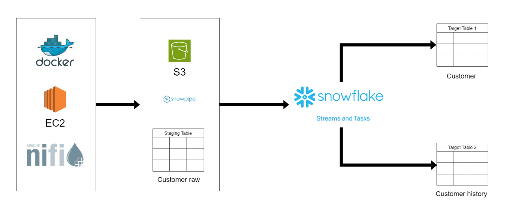

# 🚀 Automated Real-Time Data Streaming Pipeline  
*Using Apache NiFi, AWS S3, Snowflake Snowpipe, Streams, and Tasks* 🎯

---

## 🔍 Overview

This project demonstrates the design and implementation of a **real-time data streaming pipeline** that continuously ingests, processes, and transforms data with minimal latency. Leveraging modern tools and cloud services, this pipeline automates the flow from data generation to analytics-ready datasets in Snowflake. ❄️✨

---

## 🏗️ Architecture & Workflow

- **🛠️ Data Generation:**  
  Synthetic customer data created with Python and the `Faker` library inside JupyterLab.

- **🎛️ Apache NiFi:**  
  Orchestrates and streams generated data to an AWS S3 bucket for scalable cloud storage.

- **☁️ AWS S3:**  
  The landing zone for raw data files, triggering Snowpipe ingestion automatically.

- **❄️ Snowflake Snowpipe:**  
  Detects new files in S3 and ingests them near real-time into Snowflake staging tables.

- **🔄 Snowflake Streams & Tasks:**  
  - *Streams* track changes in staging tables (Change Data Capture).  
  - *Tasks* automate incremental transforms and upserts into target tables.

---

## 🎯 Key Components

| Component         | Description                                      |
|-------------------|------------------------------------------------|
| **🖥️ AWS EC2**       | Virtual server hosting Docker container and tools |
| **🐳 Docker**        | Containerized environment with Python, NiFi, ZooKeeper |
| **📓 JupyterLab**    | Workspace for data generation and experimentation  |
| **🎛️ Apache NiFi**   | Real-time data flow orchestration and routing  |
| **☁️ AWS S3**        | Cloud storage for raw data files                |
| **❄️ Snowflake**     | Cloud data warehouse for ingestion & analytics |
| **⚡ Snowpipe**      | Serverless continuous data ingestion service   |
| **🔄 Streams & Tasks** | Snowflake CDC and automation features           |

---

## ⚙️ Project Setup Summary

1. **🖥️ EC2 Configuration:**  
   Set up an AWS EC2 instance (t2.xlarge) with 8GB RAM and 32GB storage. Opened ports for JupyterLab and NiFi.

2. **🐳 Docker Setup:**  
   Created Docker container on EC2 with Python, Apache NiFi, and ZooKeeper for consistent environments.

3. **📓 JupyterLab & 🎛️ NiFi:**  
   Configured to run on ports `4888` and `2080` respectively for easy web access.

4. **🎲 Data Generation:**  
   Python scripts using Faker to simulate streaming customer data inside JupyterLab.

5. **🚚 Data Streaming:**  
   NiFi configured to push data in real-time to AWS S3 bucket.

6. **❄️ Real-Time Processing:**  
   Snowpipe auto-ingests data; Streams and Tasks handle change tracking and incremental updates.

---

## 🌟 Project Highlights

- **⚡ Real-time automated ingestion and processing** with Snowpipe, Streams & Tasks  
- **☁️ Scalable architecture** using AWS S3 and Snowflake  
- **🐳 Containerized & reproducible environment** with Docker  
- **🎼 End-to-end orchestration** powered by Apache NiFi  

---

## 🌐 Access URLs

- **📓 JupyterLab:** http://`<EC2-IP>`:4888  
- **🎛️ Apache NiFi:** http://`<EC2-IP>`:2080  

*(Replace `<EC2-IP>` with your instance's public IP)*

---

## 💡 Technologies & Skills Demonstrated

- Python & Faker for data simulation  
- Apache NiFi for data flow orchestration  
- AWS S3 cloud storage integration  
- Snowflake Snowpipe for serverless ingestion  
- Snowflake Streams & Tasks for CDC & automation  
- Docker containerization  
- Cloud infrastructure setup & security  

---

## 🎉 Conclusion

This project successfully builds an automated, end-to-end **real-time data streaming pipeline** that efficiently moves data from generation to analytics-ready datasets. It highlights modern best practices in cloud data engineering and real-time analytics. 🎊

---

